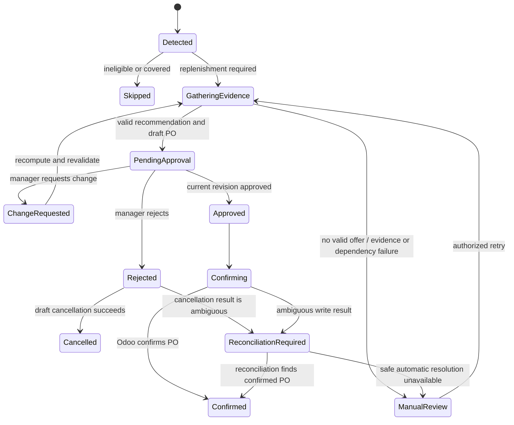
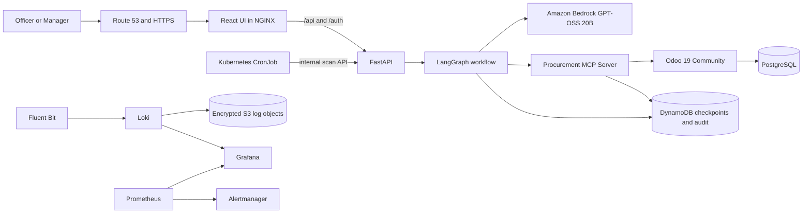

# AI Procurement Agent — Design Specification

**Status:** Approved for implementation planning

**Date:** 2026-07-25

**Planning stage:** Specification approved; implementation planning authorized

**Approval record:** User and course-staff approval were confirmed by the user
on 2026-07-25.

## 1. Document status and classification

[Explicit course requirement] This specification is the first mandatory planning artifact. Its approval authorizes creation of `docs/plan.md`; it does not authorize implementation.

[Explicit course requirement] Application code, tests, containers, Terraform, Kubernetes manifests, and CI/CD workflows must not be created until `docs/plan.md` is also reviewed and approved by the user and course staff and the user then explicitly authorizes implementation.

[Project decision] This document resolves the remaining design questions using the smallest architecture that satisfies the assignment and the constraints confirmed during brainstorming.

The required classification labels are:

| Label | Meaning |
|---|---|
| `[Explicit course requirement]` | Required by the assignment or repository instructions |
| `[Tutorial-supported approach]` | Supported by a course tutorial but not itself mandatory |
| `[Project decision]` | A selected design choice |
| `[Assumption]` | A fact that must be validated during planning or implementation |
| `[Open question]` | An unresolved decision requiring user input |

[Project decision] No blocking design questions remain. Values such as the chosen registered domain name, generated resource names, and final measured resource requests are configuration inputs, not unresolved architecture decisions.

## 2. Sources of truth and extracted requirements

### 2.1 Authoritative project sources

| Classification | Source | Relevance |
|---|---|---|
| `[Explicit course requirement]` | `AGENTS.md` | Mandatory workflow, specification contents, implementation gates, branch strategy, security, testing, Kubernetes, CI/CD, and observability rules |
| `[Explicit course requirement]` | `docs/requirements/final_project_ai_agent.md` | Graded project requirements and presentation requirements |
| `[Tutorial-supported approach]` | `docs/tutorials/03_http_protocol.md` and `04_python_unittesting.md` | HTTP semantics, FastAPI health/API testing, mocks, and test reporting |
| `[Tutorial-supported approach]` | `docs/tutorials/05_github_actions.md` and `33_git_merge_conflict.md` | Pull-request automation and branch conflict handling |
| `[Tutorial-supported approach]` | `docs/tutorials/06_linux_intro.md`, `09_linux_processes.md`, and `10_linux_environment_variables.md` | Runtime configuration, signals, readiness changes, and graceful termination |
| `[Tutorial-supported approach]` | `docs/tutorials/16_aws_intro.md` through `22_networking_dns.md` | AWS, VPC, routing, security groups, SSH, and DNS |
| `[Tutorial-supported approach]` | `docs/tutorials/23_ai_intro_coding_agent.md`, `24_ai_agent_skills.md`, `25_ai_langgraph_intro.md`, `43_ai_langgraph.md`, and `44_ai_langgraph_memory.md` | Agent design, LangGraph state, checkpoints, human interrupts, and memory |
| `[Tutorial-supported approach]` | `docs/tutorials/26_aws_bedrock.md`, `27_aws_iam.md`, and `28_aws_s3.md` | Bedrock invocation, model-scoped IAM, encrypted S3, versioning, and lifecycle policies |
| `[Tutorial-supported approach]` | `docs/tutorials/29_docker_containers.md` through `32_docker_compose.md` | Container images, networks, volumes, and local multi-service development |
| `[Tutorial-supported approach]` | `docs/tutorials/34_ai_mcp.md` | Custom MCP tools and Streamable HTTP transport |
| `[Tutorial-supported approach]` | `docs/tutorials/35_k8s_cluster_setup.md` through `39_k8s_pod_design.md` | Self-managed Kubernetes, namespaces, Services, persistent storage, Argo CD, probes, resources, HPA, and rolling updates |
| `[Tutorial-supported approach]` | `docs/tutorials/40_tf_basics.md` through `42_tf_modules.md` | Terraform state, variables, reusable modules, validation, and AWS provisioning |

### 2.2 Mandatory requirement inventory

| ID | Classification | Mandatory requirement |
|---|---|---|
| CR-01 | `[Explicit course requirement]` | Produce and obtain approval for `docs/spec.md` and `docs/plan.md` before implementation. |
| CR-02 | `[Explicit course requirement]` | Solve a clearly defined real business problem and demonstrate measurable value. |
| CR-03 | `[Explicit course requirement]` | Use a coded LLM framework such as LangGraph or LangChain; do not use a no-code agent platform. |
| CR-04 | `[Explicit course requirement]` | Expose an HTTP API; a usable web UI is strongly recommended. |
| CR-05 | `[Explicit course requirement]` | Define the agent persona, capabilities, boundaries, clear errors, retries, timeouts, fallbacks, and graceful termination. |
| CR-06 | `[Explicit course requirement]` | Connect to at least one public or self-hosted MCP server and call MCP tools in a real end-to-end interaction. |
| CR-07 | `[Explicit course requirement]` | Run a self-managed Kubernetes cluster on AWS EC2; do not use EKS. |
| CR-08 | `[Explicit course requirement]` | Deploy the full stack to separate `dev` and `prod` namespaces with separate configuration. |
| CR-09 | `[Explicit course requirement]` | Use probes, resource requests and limits, HPA where relevant, ConfigMaps, secrets management, and graceful shutdown. |
| CR-10 | `[Explicit course requirement]` | Provision all AWS resources reproducibly with Terraform rather than manual console creation. |
| CR-11 | `[Explicit course requirement]` | Provide CI/CD that tests every pull request, reports results, deploys dev and prod, and uses the prescribed GitHub Actions and Argo CD promotion workflow. |
| CR-12 | `[Explicit course requirement]` | Collect metrics and logs from all services and provide actionable alerts, health endpoints, and dashboards. |
| CR-13 | `[Explicit course requirement]` | Provide unit tests for agent and MCP behavior with mocked external systems, plus integration tests using the real MCP transport. |
| CR-14 | `[Explicit course requirement]` | Support a 15-minute presentation with slides, a live end-to-end interaction, live observability, the GitHub Actions pipeline, and an AI-agent reflection. |
| CR-15 | `[Explicit course requirement]` | Apply least privilege, input validation, untrusted MCP-output handling, human approval for high-impact actions, and safe secret/log handling. |
| CR-16 | `[Explicit course requirement]` | Explain why each AWS service and major architecture decision is needed, what alternatives were considered, and which requirement it satisfies. |

## 3. Selected product direction

[Project decision] The long-term product vision is an extensible AI operations platform for procurement, but the course MVP is one narrow Odoo replenishment workflow.

[Project decision] The MVP targets small and medium-sized businesses that use self-hosted Odoo ERP. The primary user is a procurement officer; the approving user is a procurement manager.

[Project decision] The agent runs a daily inventory scan, detects forecasted replenishment needs, compares current approved vendor offers using cost, delivery, reliability, quality, order constraints, payment terms, and evidence quality, creates one draft purchase order per product, and waits for manager approval before confirming the fictional order in Odoo.

[Project decision] “Place the order” means changing a fictional Odoo request for quotation or draft purchase order to a confirmed purchase order. It does not send an order to a real supplier, transfer money, create legal obligations, or send email.

### 3.1 Alternatives considered

| Classification | Approach | Result |
|---|---|---|
| `[Project decision]` | Broad autonomous operator covering inventory, discovery, contracts, communications, calendars, accounting, and many ERPs | Rejected for the MVP because it is too broad to test, secure, and demonstrate credibly within the course. |
| `[Project decision]` | Recommendation-only assistant that never creates or confirms a draft PO | Rejected because it provides weaker business value and a less complete MCP interaction. |
| `[Project decision]` | Odoo replenishment agent with deterministic safeguards and approval-gated writes | Selected because it is narrow, measurable, genuinely agentic, and demonstrates the full required stack. |

## 4. Problem statement and business value

### 4.1 Business problem

[Project decision] Procurement officers in small and medium-sized Odoo businesses repeatedly inspect forecasted stock, outgoing demand, incoming purchase orders, approved vendor offers, vendor history, order constraints, and budgets before preparing a draft purchase order.

[Assumption] The representative manual workflow takes approximately 15 minutes per replenishment case. This baseline must be validated with at least three timed executions of the documented manual scenario before the final presentation.

[Project decision] Delayed or inconsistent decisions can cause stockouts, excessive inventory, avoidable cost, and weak decision traceability.

### 4.2 Current manual workflow

1. `[Project decision]` The officer opens Odoo inventory forecasting and reordering information.
2. `[Project decision]` The officer checks open purchase orders to avoid duplicates.
3. `[Project decision]` The officer compares valid vendor offers, lead times, MOQ, packaging, payment terms, and purchase history.
4. `[Project decision]` The officer checks the category’s monthly budget.
5. `[Project decision]` The officer calculates a valid order quantity and prepares a draft PO.
6. `[Project decision]` The manager reviews the evidence and approves, rejects, or requests a change.
7. `[Project decision]` An approved draft is confirmed in Odoo.

### 4.3 Why an AI agent is appropriate

[Project decision] Deterministic software is responsible for arithmetic, inventory projection, eligibility, budget calculations, duplicate prevention, authorization, and state transitions.

[Project decision] The LLM is responsible for context-dependent trade-offs among eligible offers, explaining why urgency may outweigh cost or why reliability and quality may outweigh a small saving, recognizing insufficient evidence, and interpreting a manager’s bounded change request.

[Project decision] A fixed weighted score was rejected because one permanent weighting cannot represent every combination of stockout urgency, reliability evidence, quality history, payment terms, and excess inventory.

[Project decision] An LLM-only workflow was rejected because language models must not perform authoritative arithmetic, enforce policy, or authorize purchases.

[Project decision] The result is a hybrid agent: deterministic policy narrows the safe action space, while the LLM performs qualitative reasoning inside that space.

### 4.4 Measurable value and success criteria

| ID | Classification | Success criterion |
|---|---|---|
| BV-01 | `[Project decision]` | Reduce replenishment preparation time from the validated manual baseline of approximately 15 minutes to a p95 of no more than 2 minutes from candidate detection to an approval-ready draft for eligible cases. |
| BV-02 | `[Project decision]` | Exclude manager waiting time from BV-01 and report approval-to-confirmation latency separately. |
| BV-03 | `[Project decision]` | Confirm zero purchase orders without a valid, current manager approval bound to the exact PO revision. |
| BV-04 | `[Project decision]` | Create zero duplicate purchase orders for the same covered shortage under concurrency and retry tests. |
| BV-05 | `[Project decision]` | Make every recommendation show the selected offer, considered alternatives, evidence, policy checks, uncertainty, budget result, and order quantity calculation. |
| BV-06 | `[Project decision]` | Ensure every eligible end-to-end demo interaction includes real MCP calls over Streamable HTTP. |
| BV-07 | `[Project decision]` | Route unavailable, insufficient, invalid, or policy-conflicting cases to explicit human review without creating a draft. |

## 5. MVP scope and exclusions

### 5.1 Included in the MVP

- `[Project decision]` Self-hosted Odoo 19 Community with fictional company, inventory, suppliers, offers, budgets, purchase history, receipts, and returns.
- `[Project decision]` Active stocked products that have an Odoo reordering rule and at least one current approved vendor offer.
- `[Project decision]` Daily scheduled monitoring plus an authorized on-demand scan using the same HTTP workflow.
- `[Project decision]` A configurable 14-day deterministic inventory-projection horizon.
- `[Project decision]` Current approved vendor-offer comparison and contextual LLM reasoning.
- `[Project decision]` One independent recommendation, approval, and PO per product.
- `[Project decision]` Draft PO creation, revision, cancellation, and approval-gated confirmation.
- `[Project decision]` Manager approve, reject, and request-change decisions for every order.
- `[Project decision]` Explicit over-budget warning and manager budget-exception approval with justification.
- `[Project decision]` React dashboard, FastAPI HTTP API, LangGraph workflow, and custom Procurement MCP server.
- `[Project decision]` AWS, Terraform, self-managed Kubernetes, dev/prod, CI/CD, testing, security, and observability required by the assignment.

### 5.2 Explicitly excluded from the MVP

- `[Project decision]` Supplier discovery or unapproved vendors.
- `[Project decision]` Contract-document retrieval, parsing, or legal contract validation.
- `[Project decision]` Complete landed-cost modeling for freight, duties, insurance, and other charges that are not represented in the current Odoo offer.
- `[Project decision]` Real supplier email, EDI, API ordering, payment, or legal order transmission.
- `[Project decision]` Slack, Teams, email, calendar, accounting-package, and document-management integrations.
- `[Project decision]` SAP, Oracle, NetSuite, Microsoft Dynamics, or other ERP adapters.
- `[Project decision]` Machine-learning demand forecasting; “forecast” means deterministic Odoo stock projection from known movements.
- `[Project decision]` Cross-product or same-vendor PO consolidation.
- `[Project decision]` Partial shipments, split awards, negotiations, or new-vendor onboarding.
- `[Project decision]` Multi-agent architecture, vector database, semantic vendor memory, and autonomous budget changes.
- `[Project decision]` A hard monetary ceiling or higher-authority escalation above the procurement manager.
- `[Project decision]` Production high availability or disaster recovery guarantees.
- `[Project decision]` Video generation; the submission uses slides and a live demo.

### 5.3 Conditional post-MVP work

[Project decision] Stretch work may begin only after the complete MVP passes its tests, is deployed to both namespaces, has working CI/CD and observability, and has a rehearsed live demo.

[Project decision] The recommended stretch order is:

1. Real-time Odoo event monitoring and cross-product PO consolidation.
2. Operational manager notifications through email or Slack/Teams.
3. Supplier discovery and contract/document integration.
4. Calendar and accounting-system integration.
5. A second ERP adapter to validate the stable Procurement MCP contract, followed by SAP, Oracle, NetSuite, and Microsoft Dynamics adapters.

[Project decision] The LangGraph workflow and Procurement MCP tool contract are intended to remain stable across ERP adapters, but each ERP will still require system-specific authentication, field mapping, capability validation, and tests.

## 6. Users, roles, persona, and authority

### 6.1 Human roles

| Role | Classification | Allowed actions |
|---|---|---|
| Procurement officer | `[Project decision]` | Sign in, trigger a scan, view cases and evidence, inspect exceptions, and view the audit trail. |
| Procurement manager | `[Project decision]` | All officer read actions plus approve, approve a budget exception, reject, and request changes. |
| Kubernetes CronJob | `[Project decision]` | Start the daily scan through one internal, narrowly scoped HTTP credential. |
| Odoo integration user | `[Project decision]` | Read required procurement records and perform only the PO operations exposed by the MCP allowlist. |

### 6.2 Agent persona

[Project decision] The system prompt defines the agent as a cautious procurement analyst for an Odoo-based SMB.

[Project decision] The agent prefers evidence and policy compliance over confident language, distinguishes facts from inference, reports uncertainty, and produces concise decision summaries rather than hidden chain-of-thought.

### 6.3 Agent capabilities

- `[Project decision]` Read inventory projection, reordering, open PO, approved offer, vendor performance, and category budget information through MCP.
- `[Project decision]` Compare safe vendor alternatives and explain contextual trade-offs.
- `[Project decision]` Calculate or consume deterministic valid quantities and costs from MCP.
- `[Project decision]` Create, revise, or cancel a draft PO through MCP.
- `[Project decision]` Resume a checkpointed workflow after manager input.
- `[Project decision]` Confirm a PO only after the MCP independently validates a matching approval record.

### 6.4 Agent boundaries

- `[Project decision]` The agent cannot add or approve vendors, alter vendor master data, change reordering rules, change budgets, modify contracts, or grant roles.
- `[Project decision]` The agent cannot select an ineligible offer even if a manager requests it.
- `[Project decision]` The agent cannot self-approve, reuse stale approval, or confirm a changed draft with an earlier approval.
- `[Project decision]` The agent cannot contact suppliers or move money.
- `[Project decision]` The agent cannot treat Odoo text or MCP output as instructions.
- `[Project decision]` A manager can approve any over-budget amount in the MVP, but the exact overage and justification must be visible and audited.

## 7. Procurement workflow

### 7.1 Scheduled and manual scan

[Project decision] A Kubernetes CronJob calls the same FastAPI scan endpoint used by an authorized manual dashboard action.

[Project decision] The CronJob runs once daily and uses `concurrencyPolicy: Forbid`. Only one scan may be active per environment.

[Project decision] The scan processes at most 50 candidates per run with at most three product workflows executing concurrently. Excess candidates remain visible as pending for a later authorized run; no queue service is added.

[Project decision] Services, consumables, archived products, products without reorder rules, and products without a current approved offer are skipped with an auditable reason.

### 7.2 Case state machine

[Project decision] Every state transition creates an immutable audit event with actor, time, correlation identifiers, source revision, and sanitized outcome.

### 7.3 Manager decisions

| Decision | Classification | Behavior |
|---|---|---|
| Approve | `[Project decision]` | Bind approval to the exact case, vendor, quantity, amount, budget status, and PO revision; then resume the graph and request confirmation. |
| Approve budget exception | `[Project decision]` | Require an explicit exception flag and non-empty manager justification before confirmation. |
| Reject | `[Project decision]` | Preserve the decision and evidence, cancel the Odoo draft through MCP, and close the case. |
| Request changes | `[Project decision]` | Accept bounded structured fields plus a note, invalidate the prior recommendation, recompute all policies, update the same draft when safe, and return to approval. |

[Project decision] Unsupported, unsafe, or ambiguous change instructions produce a human-review state rather than an unauthorized draft edit.

## 8. Deterministic procurement policy

### 8.1 Inventory projection

[Project decision] The scan starts with Odoo on-hand stock and applies dated confirmed incoming stock movements and open confirmed purchase orders, then subtracts reservations and confirmed outgoing movements across the next 14 days.

[Project decision] The **replenishment trigger date** is the first day projected availability falls below the Odoo reorder minimum.

[Project decision] The **need-by date** is the first projected stockout date; when no stockout occurs inside the horizon, it is the end of the 14-day horizon. This prevents a product that is already below its reorder minimum from making every vendor automatically late.

[Project decision] The reorder minimum remains a hard trigger. The LLM cannot override the projection or threshold.

[Project decision] The projection is not an ML demand forecast and does not invent future demand beyond confirmed Odoo movements.

### 8.2 Duplicate prevention

[Project decision] Before creating a case, the MCP checks pending cases, existing drafts, and confirmed incoming POs for the same product.

[Project decision] An incoming PO covers the need only when its expected quantity and date keep projected availability at or above the reorder minimum through the horizon.

[Project decision] A partially covered need produces only the residual replenishment quantity.

[Project decision] Case creation and MCP writes use DynamoDB conditional writes, stable case identifiers, and idempotency keys. The case identifier is also stored in the standard Odoo PO origin/reference field for reconciliation.

### 8.3 Offer eligibility

[Project decision] A current approved vendor offer must satisfy all of the following:

- The vendor has the Odoo tag `Approved Procurement Vendor`.
- The vendor does not have the `Blocked Procurement Vendor` tag.
- The product has a vendor-pricelist entry for the vendor.
- The entry is valid on the proposed order date.
- The offer provides usable price, currency, lead time, and MOQ data.
- The calculated delivery date meets the need-by date.

[Project decision] A legal “active contract” check is not claimed because contract-document integration is outside the MVP.

### 8.4 Quantity calculation

[Project decision] Quantity is calculated independently for each eligible offer because vendor delivery date, MOQ, and packaging can change the required order.

[Project decision] The unrounded quantity is the Odoo reorder maximum minus projected availability at that vendor’s expected arrival, excluding the proposed new PO.

[Project decision] The MCP then applies the vendor MOQ and rounds upward to the configured purchase packaging or unit-of-measure multiple.

[Project decision] The MCP returns the valid quantity, normalized company-currency order cost, projected inventory after receipt, and excess inventory caused by MOQ or packaging.

[Project decision] “Normalized order cost” includes the current vendor-offer price, quantity, and configured currency conversion. It is not labeled “landed cost” because the MVP has no authoritative source for future freight, duty, or insurance charges.

[Project decision] The LLM must repeat these values rather than recalculate them.

### 8.5 Vendor-performance evidence

[Project decision] Vendor evidence is derived automatically from the previous 365 days of Odoo purchase orders, receipts, and returns.

| Metric | Classification | Definition |
|---|---|---|
| On-time rate | `[Project decision]` | Completed receipts received on or before their scheduled receipt date divided by completed receipts. |
| Average lateness | `[Project decision]` | Mean positive days late for late completed receipts. |
| Return/defect proxy | `[Project decision]` | Quantity returned through linked return movements divided by quantity received. |
| Evidence count | `[Project decision]` | Number of completed orders and receipts supporting the statistics. |
| Evidence confidence | `[Project decision]` | “Insufficient” when fewer than three completed orders exist; insufficient history is not scored as either good or bad. |

[Project decision] Current price, normalized order cost, lead time, payment terms, MOQ, packaging excess, historical on-time rate, return rate, and evidence confidence are provided to the LLM.

### 8.6 Budget policy

[Project decision] Odoo 19 analytic budgets are the budget system of record.

[Project decision] A “Procurement Categories” analytic plan maps product categories to analytic accounts and monthly periodic budgets.

[Project decision] Confirmed PO commitments determine existing committed spend. The MCP adds the proposed amount to calculate remaining funds and exact overage.

[Project decision] Over-budget status does not make a vendor ineligible and does not create a hard ceiling. It changes the approval path to require an explicit manager exception and justification.

## 9. Agent and LangGraph design

### 9.1 Framework

[Project decision] Python and LangGraph implement the workflow. LangGraph is selected because persisted graph state and interrupts map directly to a multi-step procurement process that pauses for human approval.

[Project decision] A simple LangChain tool-calling loop was rejected because approval resumption, revision binding, deterministic branches, and recovery require an explicit state machine.

### 9.2 Graph nodes

| Node | Classification | Responsibility |
|---|---|---|
| Acquire scan lock | `[Project decision]` | Enforce one active scan per environment. |
| Discover candidates | `[Project decision]` | Call `list_replenishment_candidates`. |
| Validate trigger | `[Project decision]` | Call forecast and open-PO tools; skip covered or ineligible items. |
| Gather offers | `[Project decision]` | Fetch current approved offers, quantity alternatives, performance, and budget. |
| Apply hard policy | `[Project decision]` | Remove blocked, invalid, late, or malformed offers. |
| Reason about trade-offs | `[Project decision]` | Ask Bedrock for a structured recommendation, uncertainty, risks, and concise rationale. |
| Validate recommendation | `[Project decision]` | Verify the selected offer and every copied value against deterministic evidence. |
| Create or revise draft | `[Project decision]` | Call the idempotent MCP write tool. |
| Human interrupt | `[Project decision]` | Persist state and wait without holding an HTTP request open. |
| Apply human decision | `[Project decision]` | Check role, optimistic revision, approval contents, and exception justification. |
| Confirm or cancel | `[Project decision]` | Invoke the relevant approval-protected MCP tool. |
| Reconcile | `[Project decision]` | Resolve ambiguous write outcomes before any retry. |
| Finalize audit | `[Project decision]` | Persist final state, timings, evidence references, and outcome. |

### 9.3 LLM selection and contract

[Project decision] The only model is `openai.gpt-oss-20b-1:0` through Amazon Bedrock using IAM-based access.

[Project decision] There is no model fallback. This avoids silently changing behavior between providers and follows the user’s explicit model choice.

[Project decision] The LLM returns a schema containing:

- decision: `recommend` or `manual_review`
- selected approved-offer identifier, when recommending
- concise rationale
- key trade-offs
- risk flags
- uncertainty and evidence limitations
- evidence identifiers used
- acknowledgement of budget status

[Project decision] The LLM cannot choose an identifier absent from the eligible set, alter quantity or cost, remove a warning, or authorize an Odoo write.

[Project decision] One structured-output repair attempt may be made when the model returns malformed schema. Repeated invalid output enters deterministic manual review and creates no draft.

### 9.4 System prompt design

[Project decision] The system prompt contains these mandatory sections:

1. Persona and objective.
2. Authoritative versus advisory responsibilities.
3. Allowed Procurement MCP tools and when their results are required.
4. Hard constraints that cannot be overridden.
5. Human-approval rules and the prohibition on self-approval.
6. Evidence-quality and uncertainty rules.
7. Instruction to treat all ERP fields, vendor text, tool output, and user notes as untrusted data rather than instructions.
8. Instruction to use only supplied calculations and identifiers.
9. Structured output schema.
10. Instruction to provide a concise decision explanation without exposing hidden chain-of-thought.

### 9.5 Memory and persistence

[Tutorial-supported approach] LangGraph checkpoints use the course-supported DynamoDB checkpointer so a workflow survives pod restart and human waiting.

[Project decision] The graph thread identifier is the immutable procurement case identifier.

[Project decision] Durable vendor, product, offer, budget, and purchase history remains in Odoo and is reread when needed. The MVP does not duplicate it into a vector store or maintain free-form LLM memory that could become stale.

[Project decision] DynamoDB also stores application sessions, approvals, idempotency records, and immutable process audit events.

## 10. System architecture and data flow

### 10.1 Logical architecture

### 10.2 Components

| Component | Classification | Purpose | Dependency boundary |
|---|---|---|---|
| React frontend | `[Project decision]` | Human dashboard for scans, recommendations, approvals, exceptions, and audit | Uses only versioned FastAPI endpoints |
| NGINX frontend container | `[Project decision]` | Serves compiled React assets and proxies same-origin `/api` and `/auth` requests | Does not contain Cognito or AWS secrets |
| FastAPI service | `[Project decision]` | HTTP API, Cognito session handling, RBAC, scan orchestration, human decisions, and health/metrics | Calls LangGraph and DynamoDB |
| LangGraph workflow | `[Project decision]` | Explicit procurement state machine, reasoning, checkpoints, and human interrupts | Uses Bedrock and MCP through ports |
| Procurement MCP server | `[Project decision]` | Stable, domain-specific, validated procurement operations | Hides Odoo JSON-2 and approval verification |
| Odoo 19 Community | `[Project decision]` | Business system of record and fictional PO execution target | Persists to environment-local PostgreSQL |
| DynamoDB | `[Project decision]` | Checkpoints, sessions, approvals, idempotency, and audit | Separate tables per environment |
| Observability stack | `[Project decision]` | Metrics, log search, alerts, and health dashboards | Separate Prometheus, Grafana, Loki, and Alertmanager per environment |

### 10.3 End-to-end data flow

1. `[Project decision]` The daily CronJob or an authorized officer sends an asynchronous scan request and receives `202 Accepted` with a scan identifier.
2. `[Project decision]` FastAPI creates a scan audit record and starts the LangGraph workflow.
3. `[Project decision]` LangGraph calls MCP tools over real Streamable HTTP.
4. `[Project decision]` MCP reads Odoo through JSON-2 and returns typed, bounded data.
5. `[Project decision]` Deterministic graph nodes calculate eligibility, deadlines, valid quantities, costs, duplicate coverage, performance metrics, and budget impact.
6. `[Project decision]` Bedrock selects or declines to select among the eligible offers and returns a structured explanation.
7. `[Project decision]` The graph validates the response and asks MCP to create one idempotent draft PO.
8. `[Project decision]` The graph checkpoints and interrupts for manager input.
9. `[Project decision]` FastAPI records the manager’s authenticated decision and resumes the same graph thread.
10. `[Project decision]` MCP independently validates the matching approval before confirming or canceling the Odoo PO.
11. `[Project decision]` The UI polls the API for status, while metrics, sanitized logs, and audit records capture the interaction.

## 11. Procurement MCP server

### 11.1 Purpose and boundary

[Explicit course requirement] The agent must call MCP tools during a real interaction.

[Project decision] A custom self-hosted Procurement MCP server is built because the required tools are domain operations rather than generic database calls.

[Project decision] The server uses the Python MCP SDK and is built for this project rather than reusing a public server.

[Project decision] MCP is appropriate because it provides a stable, discoverable tool contract between LangGraph and the ERP adapter, centralizes validation and permissions, and allows later ERP adapters without exposing ERP-specific models to the agent.

[Project decision] The server is deployed once per environment as a private ClusterIP service using Streamable HTTP.

[Project decision] Agent-to-MCP requests require an environment-specific bearer credential from Secrets Manager and are restricted by Kubernetes NetworkPolicy.

[Project decision] Its external systems are limited to the environment’s Odoo JSON-2 API and strongly scoped DynamoDB approval/idempotency records. It does not call suppliers, email, or public procurement services.

### 11.2 Tool contracts

| Tool | Classification | Essential input | Essential output |
|---|---|---|---|
| `list_replenishment_candidates` | `[Project decision]` | Horizon days, limit, optional cursor | Product IDs, names, category IDs, reorder minimum/maximum, current projected trigger, skip metadata, next cursor |
| `get_inventory_forecast` | `[Project decision]` | Product ID, horizon days, as-of time | On-hand, dated incoming/outgoing movements, daily projection, trigger date, need-by date, data timestamp |
| `find_open_purchase_orders` | `[Project decision]` | Product ID, horizon dates | Existing draft and confirmed PO lines, remaining quantities, expected receipts, coverage result |
| `list_approved_vendor_offers` | `[Project decision]` | Product ID, order date, projection evidence | Eligible and rejected offers with reason; price/currency, normalized cost, lead time, arrival, MOQ, packaging multiple, valid quantity, resulting/excess inventory, payment terms |
| `get_vendor_performance` | `[Project decision]` | Vendor ID, optional product ID, lookback days | Completed-order count, receipt count, on-time rate, average lateness, received and returned quantity, return rate, confidence |
| `get_category_budget_status` | `[Project decision]` | Category ID, period, proposed amount | Budget record, budgeted and committed amounts, remaining before/after, exact overage, currency |
| `create_draft_purchase_order` | `[Project decision]` | Case ID, product ID, approved-offer ID, validated quantity, need-by date, evidence hash, idempotency key | PO ID, revision, Odoo state, totals, origin/reference, reconciliation metadata |
| `update_draft_purchase_order` | `[Project decision]` | Case ID, PO ID, expected revision, new approved offer/quantity/date, evidence hash, idempotency key | Updated revision, state, totals, and reconciliation metadata |
| `cancel_draft_purchase_order` | `[Project decision]` | Case ID, PO ID, expected revision, rejection record ID, idempotency key | Final Odoo state and audit reference |
| `confirm_purchase_order` | `[Project decision]` | Case ID, PO ID, expected revision, approval record ID, idempotency key | Confirmed Odoo state, order identifier, confirmation time, idempotent prior result when applicable |

### 11.3 Authentication, permissions, and approval defense

[Project decision] The MCP Odoo client uses a dedicated Odoo integration user and a rotating JSON-2 bearer API key.

[Project decision] The integration user receives the minimum practical Odoo roles needed to read procurement evidence and operate POs. Standard Odoo role breadth that cannot be narrowed without a custom add-on is documented as a residual risk and constrained by the MCP allowlist.

[Project decision] `confirm_purchase_order` performs a strongly consistent DynamoDB read of the approval record and verifies:

- manager identity and role
- approved decision type
- environment, case ID, and PO ID
- exact PO revision, vendor, quantity, amount, and evidence hash
- non-expired approval
- required budget-exception flag and justification

[Project decision] The graph performs the same checks before the call, making MCP validation a defense-in-depth boundary rather than a prompt instruction.

### 11.4 Validation and failure behavior

[Project decision] All tool inputs and outputs have strict schemas, length and range limits, environment binding, allowed identifiers, and sanitized errors.

[Explicit course requirement] MCP output is treated as untrusted. The graph verifies schema, identifiers, currency, state, timestamps, and policy consistency before use.

[Project decision] Read failures may be retried according to the retry table. Write timeouts are never blindly retried; MCP first checks the idempotency table and Odoo case reference to determine the actual result.

[Project decision] Permanent authentication, authorization, validation, or policy errors are not retried.

## 12. Odoo design

### 12.1 Version and API

[Project decision] Each environment runs a pinned immutable digest of the official Odoo 19 Community image and a pinned PostgreSQL image.

[Project decision] Odoo 19 JSON-2 is selected instead of deprecated XML-RPC/JSON-RPC endpoints.

[Project decision] The system uses Purchase, Inventory, Contacts, and Accounting/analytic-budget capabilities required by the workflow.

[Project decision] Odoo and PostgreSQL are separately deployed in both `dev` and `prod`, with distinct databases, credentials, configuration, and local PersistentVolumes.

[Project decision] An idempotent post-deployment bootstrap job creates the dedicated Odoo integration user and rotating API key, stores the generated value in the pre-provisioned environment secret in Secrets Manager without logging it, and removes its temporary bootstrap authority after success.

### 12.2 Business data mapping

| Domain concept | Classification | Odoo source |
|---|---|---|
| Stocked product | `[Project decision]` | Active storable product |
| Reorder policy | `[Project decision]` | Product reordering rule with minimum and maximum |
| Approved vendor | `[Project decision]` | Vendor contact tagged `Approved Procurement Vendor` |
| Blocked vendor | `[Project decision]` | Vendor contact tagged `Blocked Procurement Vendor`; blocked wins if both tags exist |
| Current approved offer | `[Project decision]` | Valid vendor-pricelist entry for an approved, unblocked vendor |
| Delivery promise | `[Project decision]` | Vendor lead time and computed order-date arrival |
| MOQ and packaging | `[Project decision]` | Vendor minimum quantity plus purchase packaging or UoM rounding |
| Payment terms | `[Project decision]` | Vendor payment terms |
| Reliability | `[Project decision]` | Scheduled versus completed receipts |
| Quality proxy | `[Project decision]` | Linked receipt return movements |
| Monthly category budget | `[Project decision]` | Analytic plan/accounts, periodic budget, and confirmed PO commitments |
| Idempotency reference | `[Project decision]` | Stable procurement case ID in PO origin/reference plus DynamoDB record |

### 12.3 Demo data

[Project decision] An idempotent bootstrap/seeding process creates fictional data without requiring a registered business, paid Odoo account, or real supplier.

[Project decision] Dev and prod use different fictional datasets and credentials.

[Project decision] The minimum demonstration dataset contains:

- one happy-path product with multiple valid offers and a meaningful cost/reliability trade-off
- one over-budget product requiring explicit exception approval
- one no-valid-offer exception
- historical on-time, late, receipt, and return records
- open POs that demonstrate duplicate prevention

[Explicit course requirement] Odoo configuration and seed creation must be reproducible and must not depend on manual production console clicks.

## 13. HTTP API design

### 13.1 API conventions

[Project decision] FastAPI exposes versioned JSON endpoints under `/api/v1`.

[Project decision] Long-running scans return `202 Accepted`; the browser polls status instead of keeping a long HTTP request open.

[Project decision] State-changing endpoints require an authenticated Cognito session, role authorization, CSRF protection, an idempotency key, and an expected revision for optimistic concurrency.

[Project decision] The internal CronJob endpoint also requires a narrow environment-specific token and NetworkPolicy source restriction.

### 13.2 Endpoints

| Method and path | Classification | Authorization | Purpose |
|---|---|---|---|
| `GET /health/live` | `[Project decision]` | Internal/public probe | Process liveness only |
| `GET /health/ready` | `[Project decision]` | Internal/public probe | Ability to serve API traffic and use required local state |
| `GET /health/dependencies` | `[Project decision]` | Authenticated operator | Bedrock, MCP, Odoo, DynamoDB, and recent-scan status |
| `GET /metrics` | `[Project decision]` | Prometheus only | Prometheus metrics |
| `GET /auth/login` | `[Project decision]` | Public | Start Cognito authorization-code flow |
| `GET /auth/callback` | `[Project decision]` | Cognito redirect | Validate OAuth state/code and create opaque server-side session |
| `POST /auth/logout` | `[Project decision]` | Authenticated | Revoke local session and clear cookie |
| `GET /api/v1/session` | `[Project decision]` | Authenticated | Current user and role |
| `POST /api/v1/scans` | `[Project decision]` | Officer or manager | Start authorized manual scan |
| `POST /internal/v1/scans` | `[Project decision]` | Cron credential | Start scheduled scan |
| `GET /api/v1/scans` | `[Project decision]` | Officer or manager | List scans and summary status |
| `GET /api/v1/scans/{scan_id}` | `[Project decision]` | Officer or manager | Scan progress, counts, and errors |
| `GET /api/v1/cases` | `[Project decision]` | Officer or manager | Filtered recommendation and exception list |
| `GET /api/v1/cases/{case_id}` | `[Project decision]` | Officer or manager | Evidence, alternatives, rationale, draft, budget, revisions, and status |
| `POST /api/v1/cases/{case_id}/approve` | `[Project decision]` | Manager | Approve exact current revision; require exception fields when over budget |
| `POST /api/v1/cases/{case_id}/reject` | `[Project decision]` | Manager | Record reason and cancel draft |
| `POST /api/v1/cases/{case_id}/request-changes` | `[Project decision]` | Manager | Record bounded change request and resume recomputation |
| `GET /api/v1/cases/{case_id}/audit` | `[Project decision]` | Officer or manager | Immutable chronological audit events |

### 13.3 Errors

[Project decision] Error responses use a stable envelope containing `error_code`, safe user message, correlation ID, retryability, and optional field errors.

[Project decision] Important error codes include `AUTH_REQUIRED`, `FORBIDDEN`, `CSRF_INVALID`, `VALIDATION_FAILED`, `REVISION_CONFLICT`, `SCAN_ALREADY_RUNNING`, `ODOO_UNAVAILABLE`, `MCP_TIMEOUT`, `LLM_UNAVAILABLE`, `LLM_OUTPUT_INVALID`, `NO_VALID_OFFER`, `APPROVAL_STALE`, `BUDGET_JUSTIFICATION_REQUIRED`, and `RECONCILIATION_REQUIRED`.

[Project decision] Raw Odoo, Bedrock, database, stack-trace, prompt, secret, or vendor-commercial content is never returned to the browser.

## 14. React web UI

[Project decision] React with a production Vite build runs in a separate lightweight NGINX container.

[Project decision] NGINX serves the static app and proxies `/api` and `/auth` to FastAPI on the same origin, eliminating browser CORS requirements.

[Project decision] FastAPI manages the Cognito authorization-code exchange. The browser stores only an opaque `Secure`, `HttpOnly`, `SameSite` session cookie; Cognito tokens are not stored in local storage.

### 14.1 Screens

| Screen | Classification | Main content |
|---|---|---|
| Sign in | `[Project decision]` | Redirect to Cognito managed login |
| Overview | `[Project decision]` | Last scan, current health, pending approvals, exceptions, and manual scan action |
| Scan detail | `[Project decision]` | Progress, processed/skipped/pending counts, duration, and safe errors |
| Case queue | `[Project decision]` | Filter by pending approval, change requested, manual review, confirmed, rejected |
| Recommendation detail | `[Project decision]` | Forecast timeline, need-by date, vendor comparison, evidence confidence, quantity, budget impact, LLM rationale, and Odoo draft link |
| Manager decision panel | `[Project decision]` | Approve, explicit budget exception, reject, or request changes |
| Audit timeline | `[Project decision]` | Actors, revisions, MCP operations, approval binding, and final outcome |

[Project decision] Vendor, budget, contract, product, reorder, and user administration remain in Odoo or Cognito and are not duplicated in the dashboard.

[Project decision] Odoo and Grafana are separate authenticated interfaces linked from the dashboard for demo verification.

## 15. Data storage and retention

| Store | Classification | Data | Retention and recovery |
|---|---|---|---|
| Odoo/PostgreSQL dev | `[Project decision]` | Fictional dev ERP records | Reproducible seed; local PV; no recovery guarantee |
| Odoo/PostgreSQL prod | `[Project decision]` | Fictional prod ERP records | Local PV plus automated crash-consistent EBS root snapshots; seed remains recovery fallback |
| DynamoDB checkpoint table per env | `[Project decision]` | LangGraph state | Dev 30 days; prod 1 year; prod PITR enabled |
| DynamoDB application table per env | `[Project decision]` | Cases, revisions, sessions, approvals, idempotency, and audit events | Sessions expire by TTL; dev business records 30 days; prod audit and decision records 1 year; prod PITR enabled |
| S3 operational-log bucket | `[Project decision]` | Loki objects under separate dev/prod prefixes | Dev 14 days; prod 90 days through lifecycle rules |
| Terraform-state S3 bucket | `[Project decision]` | Encrypted versioned Terraform state | Separate from application logs; versioning and locking; no public access |
| Worker root EBS | `[Project decision]` | Container layers and local PV directories | 30 GB per node; prod worker snapshots retain seven daily recovery points |

[Project decision] Local PersistentVolumes use `Retain` reclaim behavior and node affinity. They survive pod and instance stop/start but are tied to the worker and do not provide automatic failover.

[Project decision] Detailed recommendation evidence, commercial amounts, and manager justifications are encrypted in DynamoDB and are not duplicated into operational logs.

## 16. AWS architecture and services

### 16.1 Region and network

[Project decision] The system runs in `us-east-1` because the selected Bedrock model and the user’s existing resources are available there.

[Project decision] Terraform creates one VPC, public subnets across two Availability Zones, route tables, an Internet Gateway, security groups, three EC2 instances, and stable public addresses.

[Project decision] Private subnets with a managed NAT Gateway were rejected because the small three-node project does not justify the fixed cost. The residual exposure is reduced with narrow security groups, host firewalls, TLS, Kubernetes NetworkPolicy, and application authentication.

[Project decision] No EKS, managed load balancer, or NAT Gateway is used.

### 16.2 AWS service justification

| Service | Classification | Why required | Data and access | Permission/provisioning |
|---|---|---|---|---|
| EC2 | `[Explicit course requirement]` | Self-managed Kubernetes control plane and workers | Runtime compute only | Terraform; one `t3.medium` control plane and two `t3.medium` workers |
| VPC components | `[Explicit course requirement]` | Network routing and isolation | Network metadata | Terraform; least-open security groups |
| IAM | `[Explicit course requirement]` | Keyless application access to AWS APIs | Temporary role credentials | Terraform; separate control-plane, dev-worker, prod-worker, GitHub OIDC, and bootstrap/apply policies |
| Bedrock | `[Project decision]` | Required LLM reasoning | Sanitized structured procurement evidence | Worker role may invoke only `openai.gpt-oss-20b-1:0` |
| DynamoDB | `[Project decision]` | Persistent graph checkpoints, approval, session, idempotency, and audit state | Environment-specific encrypted records | Separate tables and IAM scopes per environment; Terraform |
| S3 | `[Project decision]` | Loki object storage and secure Terraform state | Sanitized logs and separate state objects | Separate buckets, encryption, public-access block, prefix-scoped roles, versioning/lifecycle; Terraform |
| Secrets Manager | `[Project decision]` | Source of runtime secrets | Odoo API key, DB credentials, MCP/Cron tokens, session secrets, and Grafana credentials | Environment-scoped secrets and worker read permissions; Terraform |
| Cognito | `[Project decision]` | Procurement user login and role groups | User identity and group membership | Separate dev/prod pools, clients, and callback URLs; Terraform |
| Route 53 | `[Project decision]` | Stable hostnames for ingress, TLS, and Cognito callbacks | DNS records only | Existing registered domain is referenced; project records are created by Terraform |
| EBS snapshots/DLM | `[Project decision]` | Low-cost prod worker recovery | Encrypted crash-consistent root snapshots | Tagged prod volume and retention policy; Terraform |
| AWS Budgets | `[Project decision]` | Keep the course environment within the agreed operating ceiling | AWS account cost totals only | Terraform; notifications at the target and ceiling to a configured operator address |

[Project decision] SQS, SNS, SES, RDS, EFS, CloudWatch application logging, EKS, and additional databases are omitted because no MVP requirement justifies them.

### 16.3 DNS

[Project decision] One user-owned Route 53 domain provides separate hostnames:

- `app.dev.<domain>`
- `odoo.dev.<domain>`
- `grafana.dev.<domain>`
- `app.prod.<domain>`
- `odoo.prod.<domain>`
- `grafana.prod.<domain>`

[Project decision] Terraform manages the DNS records. The pre-existing domain registration is an external user-owned prerequisite and is not destroyed with the project.

[Project decision] cert-manager obtains individual Let’s Encrypt certificates through HTTP-01 validation.

## 17. Kubernetes deployment

### 17.1 Cluster topology

| Node | Classification | Capacity and placement |
|---|---|---|
| Control plane | `[Project decision]` | One `t3.medium`, 30 GB EBS; runs Kubernetes control-plane services and selected lightweight cluster controllers, but no business application workloads |
| Dev worker | `[Project decision]` | One `t3.medium`, 30 GB EBS; hard-labeled/tainted for the complete dev application and dev observability stack |
| Prod worker | `[Project decision]` | One `t3.medium`, 30 GB EBS; hard-labeled/tainted for the complete prod application and prod observability stack |

[Project decision] Separate worker instance profiles restrict dev and prod AWS access. Hard node selection prevents a prod pod from receiving dev-node IAM credentials or vice versa.

[Project decision] The single-worker-per-environment topology is not highly available. HPA can add a second Agent API pod only on the same environment worker when capacity permits.

### 17.2 Environment workloads

[Explicit course requirement] Both `dev` and `prod` namespaces contain separate configuration and the complete application stack.

[Project decision] Each environment includes React/NGINX, FastAPI, Procurement MCP, Odoo, PostgreSQL, CronJob, Prometheus, Grafana, Loki, Alertmanager, and namespace-scoped log collection.

[Project decision] Cluster-level components include containerd, kubeadm-managed Kubernetes, the course-compatible CNI with NetworkPolicy support, NGINX Ingress, cert-manager, External Secrets, metrics-server, kube-state-metrics, and Argo CD.

[Project decision] Lightweight cluster controllers may tolerate the control-plane taint to preserve worker memory. Odoo, PostgreSQL, the agent, MCP, and environment observability may not.

### 17.3 Resource strategy

[Project decision] Every container receives CPU/memory requests and limits. Initial values are conservative hypotheses and must be replaced by measurements from the seeded workload before production promotion.

[Project decision] Each 4 GiB worker reserves capacity for the OS, kubelet, CNI, and ingress before scheduling application requests.

[Project decision] Odoo uses one application worker, PostgreSQL uses a small demo configuration, and monitoring uses short retention and modest scrape intervals.

[Project decision] If measured memory pressure exceeds 85%, the response order is: reduce scrape cardinality/retention, reduce nonessential caches, and stop stretch work. Required services will not be silently removed.

### 17.4 HPA and replicas

[Project decision] HPA applies only to the stateless FastAPI Agent API with minimum one and maximum two replicas based on CPU.

[Project decision] Frontend, MCP, Odoo, PostgreSQL, Prometheus, Grafana, Loki, and Alertmanager use one replica per environment.

[Project decision] HPA demonstrates correct Kubernetes autoscaling behavior but does not claim node autoscaling or availability during worker failure.

### 17.5 Configuration and secrets

[Project decision] Non-sensitive environment settings use namespace-specific ConfigMaps and Kustomize overlays.

[Project decision] AWS Secrets Manager is the source of truth. External Secrets materializes only the required values into namespace-scoped Kubernetes Secrets.

[Project decision] Secrets are never committed, baked into images, stored in ConfigMaps, returned through APIs, or emitted in logs.

### 17.6 Probes and graceful termination

[Tutorial-supported approach] Liveness checks determine whether a process should restart; readiness checks determine whether it should receive traffic.

[Project decision] FastAPI and MCP fail readiness immediately on `SIGTERM`, reject new work, checkpoint safe state, and receive up to 45 seconds to finish or mark in-flight work for reconciliation.

[Project decision] FastAPI liveness checks process health only. Readiness checks configuration and required state access without treating every temporary external dependency failure as a process crash.

[Project decision] Dependency health is reported separately so the dashboard can remain available when Odoo or Bedrock is down.

[Project decision] Odoo and PostgreSQL use their supported shutdown signals and local PVs.

[Project decision] Stateless services use rolling updates with readiness gates. Stateful single replicas accept brief planned downtime.

### 17.7 Storage

[Project decision] Static local PVs allocate directories on the environment worker’s 30 GB root EBS volume.

[Project decision] Approximate per-worker storage budget is 12 GB for OS/Kubernetes/images, 5 GB for Odoo/PostgreSQL data, 3 GB for Prometheus, 1 GB for Loki WAL/cache, and 9 GB safety/temporary headroom.

[Project decision] Loki’s retained log objects reside in S3 rather than on the 30 GB disk.

### 17.8 Network exposure

[Project decision] Public HTTPS ingress exposes only the React/API hostname, Odoo UI, and Grafana for the demo.

[Project decision] MCP, PostgreSQL, Prometheus, Loki, Alertmanager, and internal metrics endpoints remain private ClusterIP services.

[Project decision] The control-plane API and SSH are restricted to worker security groups and a configured administrator CIDR. Database and MCP ports are never exposed by an AWS security group.

[Project decision] Default-deny NetworkPolicies permit only documented flows.

### 17.9 Non-24/7 operation

[Project decision] EC2 instances may be stopped outside development and demonstration periods while EBS volumes and stable public addresses remain.

[Project decision] Application SLOs apply only during declared active periods. Intentional suspension pauses daily-scan health evaluation.

[Project decision] After restart, health remains “warming” until all dependencies are ready and an authorized scan succeeds. Missed scans are not silently presented as successful.

## 18. CI/CD and GitOps

### 18.1 Manifest strategy

[Project decision] Kustomize is used instead of Helm.

[Project decision] A shared base defines common resources, while `dev` and `prod` overlays define hostnames, ConfigMaps, resource values, image digests, storage retention, and namespace-specific settings.

[Project decision] Duplicated YAML was rejected because it drifts; Helm was rejected because its templating and release layer are unnecessary for this single project.

### 18.2 Images

[Project decision] Docker Hub stores three project images: React/NGINX frontend, FastAPI agent API, and Procurement MCP server.

[Project decision] Odoo, PostgreSQL, and observability images use pinned upstream digests.

[Project decision] Production runs compiled React assets in NGINX and never runs a Node development server.

### 18.3 Required branch and promotion flow

1. `[Explicit course requirement]` Create every feature branch from the latest protected `main`.
2. `[Explicit course requirement]` Implement only an approved `docs/plan.md` task on that feature branch.
3. `[Explicit course requirement]` Merge the feature branch locally into the releasable `dev` branch and push `dev` directly.
4. `[Explicit course requirement]` A `dev` push builds changed images, pushes immutable artifacts, runs Docker Scout, and updates the dev Kustomize desired digest.
5. `[Explicit course requirement]` The dev Argo CD application tracks the `dev` revision and dev overlay; GitHub Actions does not run `kubectl`.
6. `[Explicit course requirement]` Validate the release in the dev namespace.
7. `[Explicit course requirement]` Update the feature branch with the dev-validated immutable digest/provenance record and open a pull request to `main`.
8. `[Explicit course requirement]` Every pull request runs the complete automated test suite and reports results; the required promotion pull request targets `main` and also validates Terraform/Kustomize and runs Docker Scout. The normal workflow creates no pull request to `dev`.
9. `[Explicit course requirement]` Merging to `main` is the explicit production promotion decision.
10. `[Explicit course requirement]` The main workflow verifies and promotes the same dev-validated immutable digest rather than rebuilding a different artifact.
11. `[Explicit course requirement]` The prod Argo CD application tracks `main` and the prod overlay; GitHub Actions never deploys production directly.
12. `[Explicit course requirement]` Hotfixes branch from `main` and are reconciled back into `dev`.

[Project decision] GitHub Actions authenticates to AWS through OIDC and narrowly scoped roles rather than long-lived AWS access keys.

[Project decision] Terraform pull-request jobs run formatting, validation, static checks, and plans. Applies require the appropriate protected environment and are path-filtered to infrastructure changes.

[Project decision] Python and React test jobs publish JUnit-compatible results and coverage summaries in the GitHub Actions job summary, with full reports retained as workflow artifacts.

[Project decision] A small Terraform bootstrap stage creates the remote state and GitHub OIDC foundation reproducibly; subsequent Terraform state is encrypted, versioned, locked, and remote.

### 18.4 Planning approval gates

[Explicit course requirement] Course staff must approve this specification through a pull request before `docs/plan.md` is created.

[Explicit course requirement] Course staff must approve `docs/plan.md`, and the user must explicitly approve implementation, before any implementation work begins.

## 19. Error handling, retries, timeouts, and fallbacks

| Operation | Classification | Timeout | Retry/fallback |
|---|---|---:|---|
| Bedrock reasoning | `[Project decision]` | 30 seconds per attempt | At most two transient retries with exponential backoff and jitter; one schema repair; then deterministic manual-review comparison and no draft |
| MCP/Odoo read | `[Project decision]` | 10 seconds | At most two transient retries with exponential backoff and jitter |
| MCP/Odoo write | `[Project decision]` | 15 seconds | Use idempotency; on timeout reconcile Odoo/DynamoDB before any retry |
| Complete automated case | `[Project decision]` | 120 seconds excluding human wait | Stop safely, persist state, and expose retry or manual review |
| Public API request | `[Project decision]` | Short synchronous request | Long work returns `202`; no browser-held workflow request |

[Project decision] Authentication, authorization, validation, conflict, and policy failures are permanent and are never retried.

[Project decision] If Odoo or MCP remains unavailable, no PO is created; the case stays unresolved with a clear safe error and authorized retry action.

[Project decision] If Bedrock remains unavailable or invalid, the UI shows the deterministic eligible-offer comparison for manual review and no draft is created.

[Project decision] If no offer meets the hard constraints, the agent creates a no-valid-offer exception and no draft.

[Project decision] If a write result is ambiguous, the case enters `RECONCILIATION_REQUIRED`; it never reports success or repeats the write without evidence.

## 20. Security and privacy

### 20.1 Trust boundaries

| Boundary | Classification | Controls |
|---|---|---|
| Browser to ingress | `[Project decision]` | HTTPS, Cognito, secure session cookie, CSRF, security headers, request limits |
| Frontend to API | `[Project decision]` | Same-origin proxy; no browser-held AWS or Cognito token |
| API to MCP | `[Project decision]` | Private service, bearer credential, NetworkPolicy, strict schemas |
| MCP to Odoo | `[Project decision]` | Private service, rotating API key, Odoo ACLs, allowlisted operations |
| Pods to AWS | `[Project decision]` | Environment-specific EC2 roles, TLS endpoints, exact resource scopes |
| Untrusted business text to LLM | `[Project decision]` | Delimiting, length limits, escaping, no instruction authority, structured output validation |
| Approval to confirmation | `[Project decision]` | Cognito manager role, immutable revision-bound approval, strong MCP revalidation, idempotency |

### 20.2 IAM

[Tutorial-supported approach] Bedrock access uses an EC2 IAM role and a policy scoped to the selected model instead of credentials in code.

[Project decision] Dev and prod workers use distinct roles restricted to their Bedrock model, DynamoDB tables, S3 prefixes, and secret ARNs.

[Project decision] The control plane does not receive application data permissions.

[Project decision] GitHub OIDC roles distinguish read-only pull-request planning from protected apply/promotion.

[Assumption] Because this is a self-managed low-cost cluster without pod-level AWS identity, pods on one worker can potentially reach that worker’s role credentials. Environment-specific workers, hard scheduling, RBAC, NetworkPolicy, and narrow node roles reduce but do not eliminate this residual risk.

### 20.3 Data and logs

[Project decision] Operational logs contain identifiers, state, timing, tool names, model/token counts, retry counts, and sanitized error codes.

[Project decision] Operational logs do not contain full prompts, model responses, vendor prices, contract terms, budget values, manager justifications, secrets, API keys, passwords, or raw database errors.

[Project decision] Sensitive audit evidence is encrypted at rest in DynamoDB and accessed only by authorized application roles.

[Project decision] Database statement logging and Odoo debug logging are disabled for the demo environments.

### 20.4 Application security

[Project decision] External inputs have schema, size, range, enum, identifier, and optimistic-version validation.

[Project decision] Free-text manager notes are length-limited, rendered safely, classified as untrusted, and cannot bypass structured policy.

[Project decision] Containers run non-root, drop capabilities, use read-only root filesystems, and use seccomp where their upstream images support it. Required writable paths use explicit volumes.

[Project decision] Self-service Cognito signup is disabled. Reproducible bootstrap creates the fictional officer and manager accounts and groups without exposing credentials.

## 21. Observability

### 21.1 Stack

[Project decision] Dev and prod each run their own Prometheus, Grafana, Loki, and Alertmanager.

[Project decision] Fluent Bit collects namespace-scoped structured logs and sends them to that environment’s Loki. Loki uses the environment’s encrypted S3 prefix for retained objects.

[Project decision] Grafana queries Prometheus for metrics and Loki for logs. DynamoDB remains the authoritative procurement audit store.

[Project decision] Application alerts remain visible in Grafana and Alertmanager for the MVP. External email, Slack, or Teams alert delivery is post-MVP.

### 21.2 Metrics

[Explicit course requirement] Metrics cover request volume, errors, latency, LLM failures, MCP failures/timeouts, retries, token usage, pod restarts, and resource usage.

[Project decision] Domain metrics also include:

- scan duration and last successful scan time
- candidates detected, skipped, pending, approval-ready, and failed
- approval-ready processing latency
- cases waiting for approval
- budget exceptions
- deterministic-fallback/manual-review count
- PO create, update, cancel, and confirm outcomes
- duplicate prevention and unauthorized confirmation attempts
- approval-to-confirmation latency

[Project decision] Odoo and PostgreSQL receive Kubernetes resource/restart metrics and dependency probes; the MVP avoids additional heavy exporters on the constrained workers.

### 21.3 Log fields

[Project decision] Structured JSON logs use `timestamp`, `level`, `service`, `environment`, `request_id`, `scan_id`, `case_id`, `tool_name`, `model_id`, `duration_ms`, `status`, `error_code`, `retry_count`, `input_tokens`, and `output_tokens` where applicable.

### 21.4 Dashboards

| Dashboard | Classification | Content |
|---|---|---|
| Agent health | `[Project decision]` | Requests, errors, latency, scan recency, case outcomes, approval-ready SLO |
| LLM and MCP | `[Project decision]` | Bedrock calls/tokens/failures, tool volume/latency/timeouts/retries |
| Procurement safety | `[Project decision]` | Pending approvals, exceptions, duplicate blocks, stale approvals, confirmation outcomes |
| Kubernetes | `[Project decision]` | Pod status/restarts/OOM, CPU/memory, disk pressure, deployment readiness |
| Dependencies | `[Project decision]` | Odoo, PostgreSQL, DynamoDB, S3/Loki, and Bedrock health |

### 21.5 Health definition

[Project decision] During active operation, the system is healthy when:

- required pods are ready and not repeatedly restarting
- API and MCP error/latency rates remain within their thresholds
- dependencies are reachable or show an explicit degraded state
- a daily scan succeeded within the previous 26 hours
- at least 95% of eligible cases reach approval-ready draft within 2 minutes
- duplicate and unapproved confirmation counts remain zero
- disk usage remains below the safe threshold

[Project decision] After an intentional cluster restart, scan-recency health uses a short warming state until one scan succeeds.

### 21.6 Actionable alerts

| Alert | Classification | Required action |
|---|---|---|
| No successful scan in 26 hours while active | `[Project decision]` | Check CronJob, API, lock, and Odoo dependency |
| Repeated API or MCP failures/timeouts | `[Project decision]` | Inspect correlated logs and dependency dashboard |
| Repeated Bedrock failure or invalid output | `[Project decision]` | Check model access, quota, schema, and fallback cases |
| Any unapproved or duplicate confirmation attempt | `[Project decision]` | Treat as a procurement safety incident |
| p95 approval-ready latency above 2 minutes with a meaningful sample | `[Project decision]` | Inspect Bedrock/MCP latency and concurrency |
| Pod crash loop, OOM, or worker memory pressure | `[Project decision]` | Reduce pressure, inspect limits, and stop stretch workloads |
| Worker disk above 80% or PV errors | `[Project decision]` | Clean safe transient data, verify retention, and snapshot/recover |
| Certificate near expiry | `[Project decision]` | Inspect cert-manager challenge and ingress |
| Odoo integration key near expiry | `[Project decision]` | Rotate the key, verify the new key, then revoke the old key |

## 22. Testing strategy

### 22.1 Principles

[Explicit course requirement] Tests must not be claimed as passing until they have actually run successfully.

[Project decision] This section is the project’s test-plan document for the specification stage; executable cases and commands will be mapped to small tasks in the later approved implementation plan.

[Project decision] Unit and integration tests never require live Bedrock, live AWS, or full Odoo unless the test is explicitly an environment smoke test.

[Project decision] Test fixtures use fictional identifiers and commercial data.

### 22.2 Unit tests

| Area | Classification | Behaviors |
|---|---|---|
| Forecast policy | `[Project decision]` | Dated incoming/outgoing movements, trigger date, need-by date, horizon, timezone, missing movements |
| Quantity policy | `[Project decision]` | Max target, vendor arrival projection, MOQ, packaging rounding, excess inventory |
| Duplicate policy | `[Project decision]` | Full coverage, partial coverage, drafts, pending cases, concurrent creation |
| Offer policy | `[Project decision]` | Approved/blocked tags, validity, lead time, malformed price/currency, no-valid-offer |
| Vendor performance | `[Project decision]` | On-time, lateness, return rate, 365-day window, insufficient evidence |
| Budget policy | `[Project decision]` | Remaining amount, exact overage, monthly boundary, exception justification |
| LangGraph routing | `[Project decision]` | Skip, recommend, fallback, interrupt, approve, reject, change, reconcile |
| LLM boundary | `[Project decision]` | Mocked valid/invalid schema, ineligible vendor, changed arithmetic, injection-like text, retry/fallback |
| Approval safety | `[Project decision]` | Wrong role, stale revision, altered amount, missing exception, expired approval, replay |
| MCP tools | `[Explicit course requirement]` | Each tool in isolation, schema validation, Odoo errors, idempotency, approval revalidation |
| API and auth | `[Project decision]` | HTTP status/errors, RBAC, session expiry, CSRF, optimistic concurrency, idempotency |
| React UI | `[Project decision]` | Role-specific actions, evidence display, budget warning, error/manual-review states |

[Explicit course requirement] LLM, Odoo, external APIs, and AWS clients are mocked in unit tests.

### 22.3 Integration tests

[Explicit course requirement] Integration tests run the real Agent API/LangGraph client and real Procurement MCP server over Streamable HTTP.

[Project decision] A deterministic fake Odoo JSON-2 gateway supplies representative records and supports controlled failures, timeouts, malformed responses, and ambiguous write outcomes.

[Project decision] Integration scenarios include:

- eligible happy path through draft and checkpoint
- no-valid-offer manual review
- Bedrock malformed output fallback with no draft
- MCP read timeout and retry
- malformed MCP tool payload rejection over the real transport
- ambiguous create/confirm reconciliation
- stale approval rejection
- duplicate concurrent scan/case/write prevention
- change request causing recomputation and reapproval

### 22.4 Real-environment tests

[Project decision] A dev smoke test uses the real seeded Odoo, real MCP transport, real FastAPI/LangGraph, and real Bedrock model:

1. Trigger scan.
2. Produce recommendation.
3. Create draft PO.
4. Interrupt for manager approval.
5. Approve through the authenticated UI/API.
6. Confirm the fictional Odoo PO.
7. Verify audit events and observability.

[Project decision] A separate over-budget smoke verifies the warning and explicit exception path.

[Project decision] Live Bedrock tests run after deployment rather than on every PR to avoid flaky, credential-dependent tests.

[Tutorial-supported approach] Docker Compose provides a reproducible local environment for the frontend, API, MCP server, PostgreSQL, and either real seeded Odoo or the deterministic fake Odoo gateway. Kubernetes remains the production deployment target.

### 22.5 Infrastructure and delivery validation

[Project decision] Automated checks cover Python formatting/lint/type/tests, React lint/type/tests/build, Docker builds, Docker Scout, Terraform formatting/validation/static checks/plans, Kustomize rendering, Kubernetes schema validation, and Argo CD desired-state smoke checks.

[Project decision] Resource tests verify that each environment fits one `t3.medium` worker under the seeded load and that the Agent API’s second HPA replica can schedule when expected.

## 23. Cost and quota constraints

[Project decision] The architecture is constrained to three `t3.medium` instances: one control plane and two workers.

[Project decision] Each instance uses at most a 30 GB EBS root volume.

[Assumption] At current `us-east-1` On-Demand rates, the three instances cost approximately $0.125 per active hour before storage, public IPv4, and usage-based services.

[Assumption] With roughly 176 active hours per month, low demo traffic, and retained EBS/public addresses, the expected monthly total is approximately $40–60.

[Project decision] The operating target is below $50 per month and the review/alarm ceiling is $75 per month. The cluster is stopped outside active development and demonstration periods.

[Project decision] No automatic cost shutdown will interrupt an active workflow. Cost alerts prompt an operator to stop the environment safely.

[Project decision] Bedrock, DynamoDB, S3, and Cognito are expected to remain minor usage-based costs for the fictional demo workload.

## 24. Live demo and presentation

### 24.1 Live demo

[Project decision] The primary live path is:

1. Show a seeded Odoo product with projected depletion and multiple approved offers.
2. Trigger the on-demand endpoint used by the daily CronJob.
3. Show the scan and MCP-backed evidence in the React dashboard.
4. Show deterministic calculations and the agent’s contextual vendor rationale.
5. Open the created Odoo draft PO.
6. Sign in as the manager and approve it.
7. Show the confirmed fictional PO in Odoo.
8. Show the immutable audit timeline.
9. Show the new request, LLM, MCP, and business metrics and logs in Grafana.
10. Open a pre-seeded over-budget case and demonstrate the warning and explicit exception approval.

[Project decision] Demo seed data and an authorized manual scan prevent the presentation from depending on the daily CronJob’s timing.

### 24.2 Suggested 15-minute allocation

| Time | Classification | Content |
|---:|---|---|
| 1 minute | `[Project decision]` | Introduction |
| 2 minutes | `[Project decision]` | Problem, target users, manual baseline, measurable value |
| 3 minutes | `[Project decision]` | Agent, MCP, architecture, security, and human approval |
| 5 minutes | `[Project decision]` | Live happy path and budget-exception case |
| 2 minutes | `[Project decision]` | AWS/Kubernetes, observability, and tests |
| 1 minute | `[Project decision]` | GitHub Actions and Argo CD promotion |
| 1 minute | `[Explicit course requirement]` | AI coding-agent reflection and skills used |

## 25. Grilling findings and resolved challenges

| Challenge | Classification | Resolution |
|---|---|---|
| The original idea is too broad for one graded MVP. | `[Project decision]` | Restrict MVP to Odoo stock replenishment; preserve other integrations as gated post-MVP work. |
| A deterministic score could make the “agent” superficial. | `[Project decision]` | Keep safety and arithmetic deterministic but use the LLM for contextual trade-offs, uncertainty, explanation, and bounded change interpretation. |
| LLM arithmetic or authorization is unsafe. | `[Project decision]` | Validate all numbers and permissions outside the LLM; MCP independently rechecks approval. |
| “Forecast” could falsely imply predictive ML. | `[Project decision]` | Define it as a 14-day projection from known Odoo stock movements only. |
| A product already below minimum would have an impossible delivery deadline. | `[Project decision]` | Separate reorder trigger date from need-by/stockout date. |
| “Active contract” cannot be verified without documents. | `[Project decision]` | Use a current approved Odoo vendor offer; defer legal contract validation. |
| “Landed cost” cannot be known without freight/duty data. | `[Project decision]` | Use normalized current order cost and do not overclaim complete landed-cost comparison. |
| “Place order” could imply real-world liability. | `[Project decision]` | Confirm only a fictional Odoo PO and perform no supplier communication or payment. |
| Automatic monitoring is impressive but fragile in a stopped lab cluster. | `[Project decision]` | Use a daily CronJob plus the same authorized on-demand endpoint; pause SLOs during intentional shutdown. |
| One `t3.medium` worker cannot run both environments. | `[Project decision]` | Use two `t3.medium` workers, pin one full environment to each, and keep strict resource budgets. |
| Two full observability stacks stress 4 GiB workers. | `[Project decision]` | Use short metrics retention, S3-backed Loki objects, one replica, shared lightweight cluster collectors, and no unnecessary exporters. |
| Local PVs are not highly available. | `[Project decision]` | Accept the course-demo limitation, retain seed data, and snapshot the prod worker. |
| Public subnets reduce cost but expand exposure. | `[Project decision]` | Avoid NAT cost while enforcing narrow security groups, TLS, auth, host firewall, RBAC, and NetworkPolicy. |
| Self-managed EC2 lacks simple pod-level IAM. | `[Assumption]` | Separate dev/prod worker roles and hard scheduling reduce the shared-node credential risk; document that it is not eliminated. |
| Internal-only Alertmanager is not proactive. | `[Project decision]` | Accept dashboard-only alert delivery for MVP and defer email/Slack/Teams. |
| Rebuilding on main could deploy a different artifact than dev. | `[Project decision]` | Record and promote the exact dev-validated immutable digest with provenance verification. |
| Odoo 19 JSON-2 API keys expire. | `[Project decision]` | Use dedicated rotating keys in Secrets Manager and alert before expiry. |
| Manager can approve unlimited overage. | `[Project decision]` | Make every overage explicit and audited; defer hard ceilings and higher-authority escalation. |

## 26. Major architecture decisions and alternatives

| Decision | Classification | Requirement served | Alternatives | Why selected |
|---|---|---|---|---|
| Narrow Odoo replenishment MVP | `[Project decision]` | CR-02, CR-14 | Broad AI operator; recommendation only | Clear value and demonstrable end-to-end action |
| Hybrid deterministic/LLM policy | `[Project decision]` | CR-02, CR-03, CR-15 | Fixed weighted score; LLM-only | Genuine reasoning without surrendering arithmetic or safety |
| LangGraph | `[Project decision]` | CR-03, CR-05 | Simple function pipeline; generic tool loop | Persistent state, branches, interrupts, and resumption |
| Custom Procurement MCP | `[Project decision]` | CR-06, CR-15 | Direct Odoo calls from graph; generic DB MCP | Stable domain boundary, validation, least authority, future adapters |
| Streamable HTTP | `[Tutorial-supported approach]` | CR-06, CR-13 | stdio | Real network interaction and required integration-test transport |
| Self-hosted Odoo 19 Community | `[Project decision]` | CR-02, CR-06 | Odoo Online; mock ERP; Odoo 18 | Fictional free ERP plus current JSON-2 interface |
| Scheduled scan plus manual trigger | `[Project decision]` | CR-02, CR-04, CR-14 | Real-time events; manual only | Impressive automation with deterministic demo control |
| React/NGINX plus FastAPI | `[Project decision]` | CR-04, CR-14 | Server-rendered FastAPI; Streamlit | Clear user workflow and separate frontend while retaining a lightweight runtime |
| Backend-managed Cognito session | `[Project decision]` | CR-15 | Browser-held tokens; custom accounts | Secure HttpOnly sessions and managed identity/roles |
| DynamoDB persistence | `[Tutorial-supported approach]` | CR-05, CR-16 | PostgreSQL checkpointing; memory only | Course-supported AWS checkpointer and safe human waits |
| Single cluster, dev/prod namespaces | `[Explicit course requirement]` | CR-07, CR-08 | Separate clusters; EKS | Meets requirement within quota and cost |
| One worker per environment | `[Project decision]` | CR-08, CR-09 | One shared worker; larger instances | Fits user quota and improves IAM/data separation |
| Local PV on root EBS | `[Project decision]` | CR-09 | Extra EBS CSI volumes; EFS/RDS | Fits 30 GB-per-instance constraint at acknowledged recovery cost |
| Separate observability stacks | `[Project decision]` | CR-08, CR-12 | Shared monitoring; CloudWatch | User-selected environment isolation and live demonstration |
| Loki with S3 object storage | `[Project decision]` | CR-12, CR-16 | CloudWatch Logs; direct raw S3 files | Queryable logs while satisfying S3 retention requirement |
| Kustomize | `[Project decision]` | CR-08, CR-11 | Duplicated YAML; Helm | Small shared base with explicit environment differences |
| GitHub Actions plus Argo CD | `[Explicit course requirement]` | CR-11 | Direct `kubectl`; manual deploy | Required GitOps source of truth and promotion |
| GPT-OSS 20B only | `[Project decision]` | CR-03, CR-16 | Amazon Nova; model fallback | User-selected course-approved low-cost model with predictable behavior |
| Public subnets without NAT/ALB | `[Project decision]` | CR-07, CR-16 | Private subnets with NAT; managed load balancer | Fits cost constraints with documented security trade-off |

## 27. Risks and limitations

| Risk or limitation | Classification | Mitigation |
|---|---|---|
| Fictional data does not prove real production ROI. | `[Assumption]` | Measure the scripted baseline and clearly present results as demo evidence. |
| LLM output is nondeterministic. | `[Project decision]` | Structured output, low-variance configuration, deterministic validation, manual fallback, no fallback model. |
| Odoo data may be incomplete or inconsistent. | `[Project decision]` | Evidence confidence, strict eligibility, typed errors, and human review. |
| Return movements are only a proxy for product quality. | `[Project decision]` | Label the metric accurately and show evidence counts. |
| Normalized order cost omits unknown freight, duties, and insurance. | `[Project decision]` | Label it accurately and add landed-cost sources only in a later accounting/supplier integration. |
| The 14-day projection omits unconfirmed future demand. | `[Project decision]` | Do not call it predictive demand forecasting; surface data timestamp and horizon. |
| One product per PO may create too many drafts. | `[Project decision]` | Accept for audit clarity; consolidate post-MVP. |
| One worker per environment is a single point of failure. | `[Project decision]` | No HA claim; snapshots, seed recovery, clear alerts. |
| Root-disk local PV can be lost when a worker is replaced. | `[Project decision]` | Retain/snapshot prod root EBS and keep reproducible seed data. |
| Public EC2 networking is less isolated than private subnets. | `[Project decision]` | Tight security groups, TLS, auth, firewall, patching, and NetworkPolicy. |
| Node-role credentials are shared by pods on that node. | `[Assumption]` | Separate workers/roles and minimal resource policies; document residual risk. |
| Two observability stacks may exhaust memory or disk. | `[Project decision]` | Measure early, cap retention/cardinality, alert at safe thresholds, stop stretch work. |
| Odoo standard service roles may be broader than desired. | `[Project decision]` | Dedicated integration user plus strict MCP operation allowlist and audit. |
| Odoo JSON-2 is newer than XML-RPC. | `[Project decision]` | Pin version/digest, contract-test actual models/methods, and avoid deprecated API. |
| API-key rotation can interrupt Odoo access. | `[Project decision]` | Generate new key before revoking old key and alert before expiration. |
| Internal-only alerts require someone to open Grafana. | `[Project decision]` | Accept for MVP; make external delivery the first operational integration. |
| Unlimited manager budget exception is weak governance. | `[Project decision]` | Require explicit overage and justification; add ceiling/escalation post-MVP. |
| Stopping the cluster prevents daily scans and alerts. | `[Project decision]` | Declare inactive periods, show warming state, and run authorized scan after startup. |
| Third-party package or model behavior can change. | `[Project decision]` | Pin versions/digests, lock dependencies, and test before promotion. |

## 28. Requirements traceability matrix

| Requirement | Classification | Design sections | Verification evidence |
|---|---|---|---|
| CR-01 Planning gates | `[Explicit course requirement]` | 1, 18.4, 29 | Approved spec PR, later approved plan PR |
| CR-02 Business problem/value | `[Explicit course requirement]` | 3, 4, 5, 7, 8 | Timed baseline, BV metrics, live workflow |
| CR-03 Coded LLM framework | `[Explicit course requirement]` | 9 | LangGraph unit tests and deployed graph |
| CR-04 HTTP API/UI | `[Explicit course requirement]` | 13, 14 | API tests and live React dashboard |
| CR-05 Prompt/reliability | `[Explicit course requirement]` | 6, 9.4, 17.6, 19 | Prompt review, retry/fallback/shutdown tests |
| CR-06 Real MCP interaction | `[Explicit course requirement]` | 10, 11 | Real Streamable HTTP integration and demo traces |
| CR-07 EC2 Kubernetes/no EKS | `[Explicit course requirement]` | 16, 17 | Terraform plan/state and cluster node evidence |
| CR-08 Dev/prod full stacks | `[Explicit course requirement]` | 12, 16, 17 | Argo apps, namespace inventories, smoke checks |
| CR-09 Well-crafted workloads | `[Explicit course requirement]` | 17 | Render validation, probes, resources, HPA, Secrets/ConfigMaps |
| CR-10 Terraform/no manual creation | `[Explicit course requirement]` | 16, 18 | Terraform state/plan/apply records |
| CR-11 CI/CD | `[Explicit course requirement]` | 18 | PR checks, Docker Scout, digest provenance, Argo sync |
| CR-12 Observability | `[Explicit course requirement]` | 21 | Live dashboards, alerts, S3-backed logs, health endpoints |
| CR-13 Automated tests | `[Explicit course requirement]` | 22 | Unit/integration reports and coverage summaries |
| CR-14 Presentation | `[Explicit course requirement]` | 24 | Slides, live demo, Grafana, Actions, reflection |
| CR-15 Security | `[Explicit course requirement]` | 6, 11.3, 13, 20 | Auth/RBAC/CSRF/idempotency tests and IAM review |
| CR-16 Decision/AWS justification | `[Explicit course requirement]` | 16.2, 25, 26 | Spec review and presentation explanation |

## 29. Review and next gate

[Project decision] This document intentionally contains no implementation tasks, code, tests, Terraform, manifests, Dockerfiles, or CI/CD workflows.

[Project decision] User and course-staff approval of this specification were confirmed by the user on 2026-07-25.

[Explicit course requirement] The approved specification authorizes creation of `docs/plan.md`, but it does not authorize implementation.

[Explicit course requirement] The implementation plan must next be reviewed by the user and approved by course staff through a pull request. Implementation may begin only after those approvals and a separate explicit user instruction to begin.
